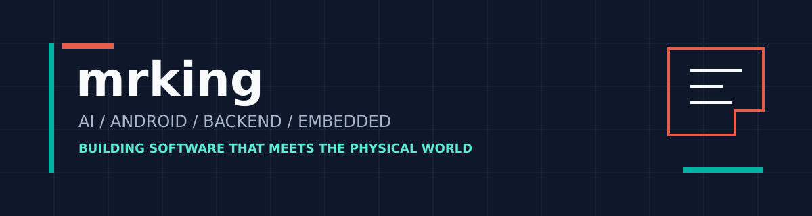

  

  
  
  

## 关于我

我是 **mrking**，来自成都的软件工程学生。目前专注于把 AI、移动端、后端与嵌入式硬件连接成真正可运行的产品，而不只是停留在单一技术演示。

- 正在维护 Android、Flask 后端和 ESP32-S3 固件组成的「智能冰箱贴」开源项目。
- 持续学习 AI 应用、Text-to-SQL、推荐系统和模型工程。
- 关注 Kotlin / Jetpack Compose、Python Web、ESP-IDF、Linux 与工程自动化。
- 喜欢通过完整项目验证想法：从界面、API、协议到真实设备构建与测试。

## 代表项目

### [智能冰箱贴 / Smart Fridge Magnet](https://github.com/tking007/smart_fridge_magnet)

一个面向真实硬件的跨端开源项目：Android App 管理库存与设备，Flask 后端负责 AI、菜谱、渲染和同步，ESP32-S3 固件驱动 792 x 528 六色电子纸。

`Kotlin` `Jetpack Compose` `Python` `Flask` `ESP32-S3` `ESP-IDF` `BLE` `E-paper` `GitHub Actions`

### 其他学习项目

| 项目 | 内容 |
| --- | --- |
| [高考志愿填报辅助系统](https://github.com/tking007/hugging_face_test) | Django、Qwen、Text-to-SQL、推荐算法与智能问答的综合学习项目。 |
| [NLQ to SQL](https://github.com/tking007/hugging_face_tes_02) | 自然语言查询到 SQL 的实验与 Notebook 记录。 |
| [天气预测可视化](https://github.com/tking007/pre_weather_flask) | 基于 Python、scikit-learn 和 Flask 的天气预测可视化实践。 |
| [读书计划](https://github.com/tking007/read_book_plan) | 阅读与长期学习记录。 |

## 技术方向

  
  
  
  
  
  
  
  
  
  
  
  
  

## GitHub 数据

  
  

<picture>
  <source media="(prefers-color-scheme: dark)" srcset="https://raw.githubusercontent.com/tking007/tking007/output/github-contribution-grid-snake-dark.svg">
  <source media="(prefers-color-scheme: light)" srcset="https://raw.githubusercontent.com/tking007/tking007/output/github-contribution-grid-snake.svg">
  
</picture>

---

  用完整项目持续学习，用开源记录真实进步。 
  Learning by building systems that work end to end.

